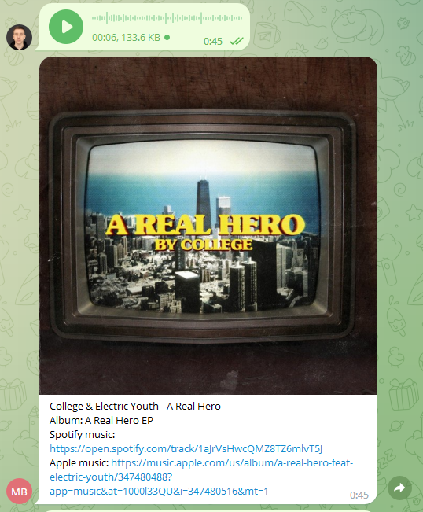
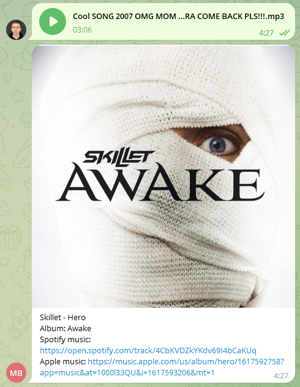
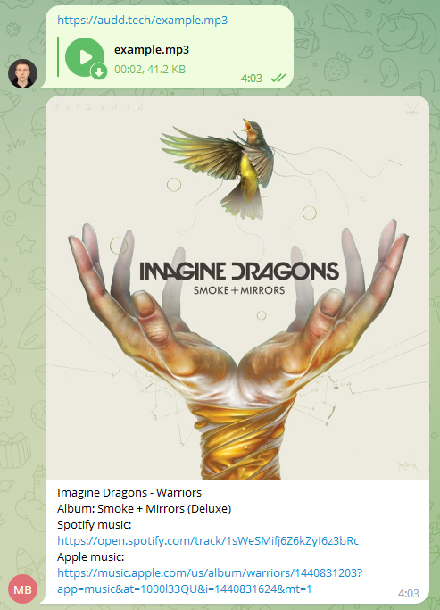

# Telegram bot for music recognition

Simple telegram bot for music recognition within the educational SPBSTU project.

_[Software Engineering course](https://github.com/SemenMartynov/Software-Engineering-2022)_

Bot based on [music recognition API](https://docs.audd.io/)

## Bot functionality

Bot can recognize music from your voice message:

Also, you can attach some audiofile:

And finally, you can recognize music from the link directly

## Build
For successfully running bot, you need to get 2 api keys:

1) `TELEGRAM_API_KEY` - key you can get from telegram [BotFather](https://t.me/BotFather)
2) `AUDD_IO_API_KEY` - music recognition api key from [audd.io](https://audd.io/)

These keys must be written in the file `src/constants.py` instead of placeholders

The build happens through [Docker](https://docs.docker.com/).
- `docker build -t donebd/tg_bot .` - for build image
- `docker run —name tg_bot donebd/tg_bot` - for run containter

